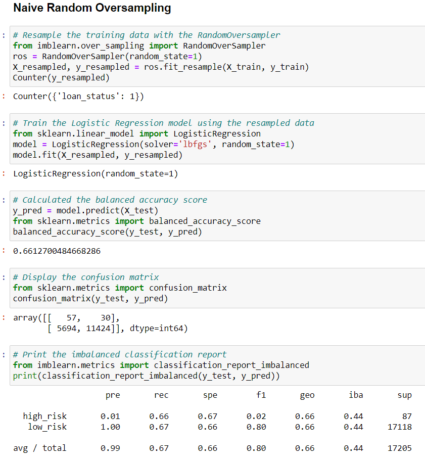
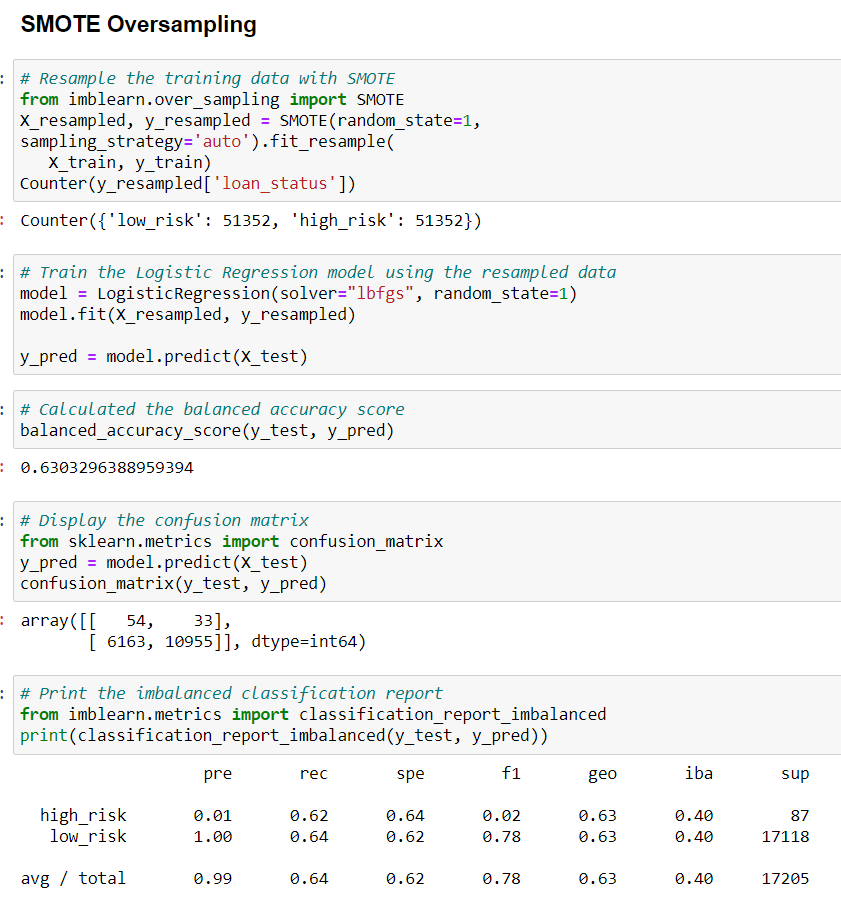
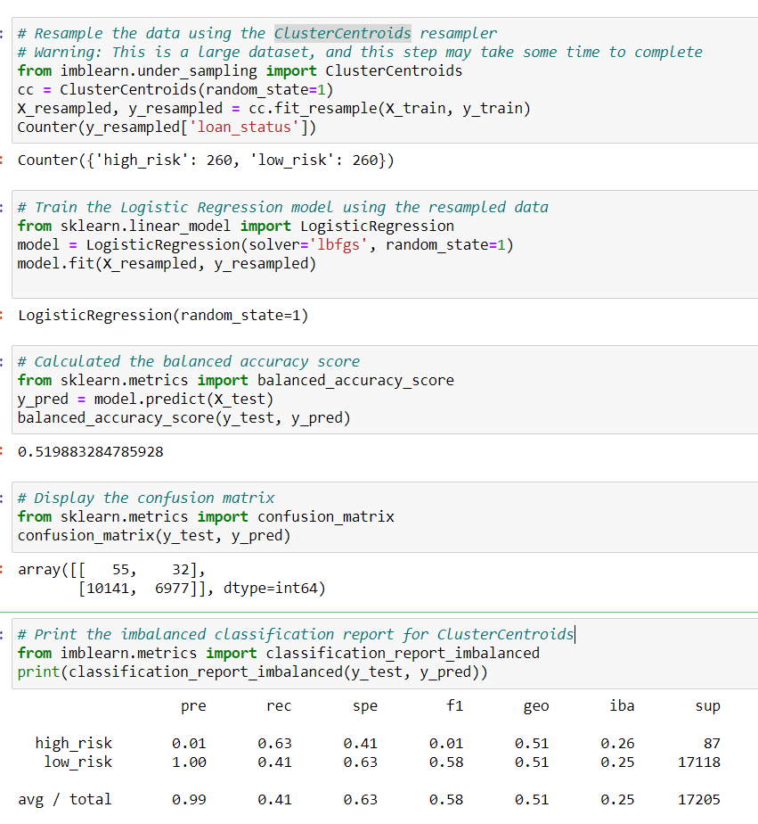
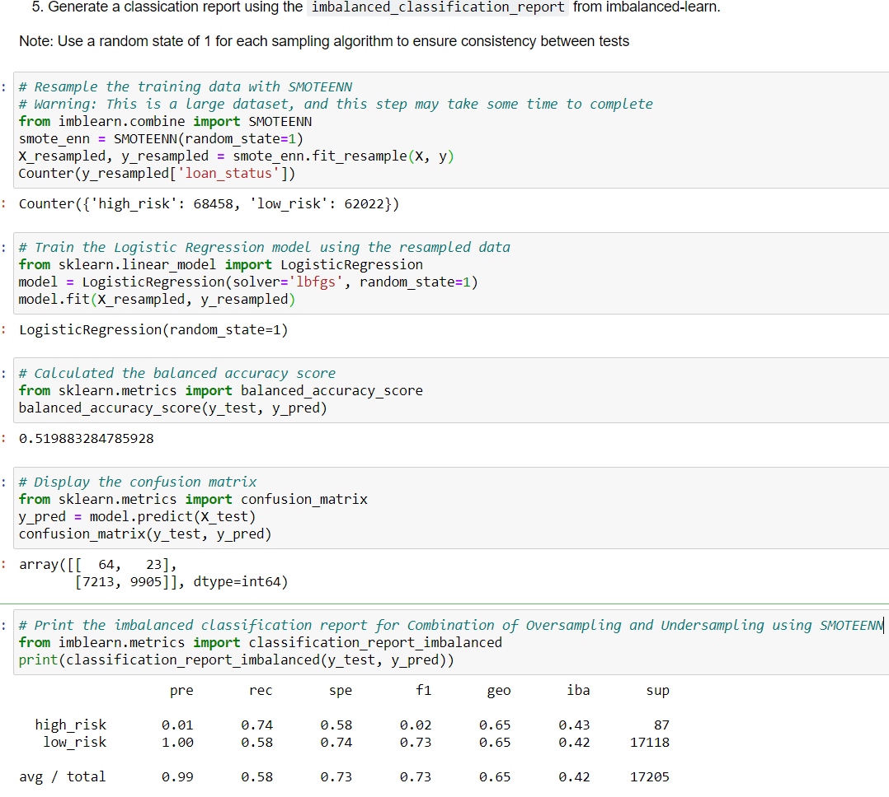
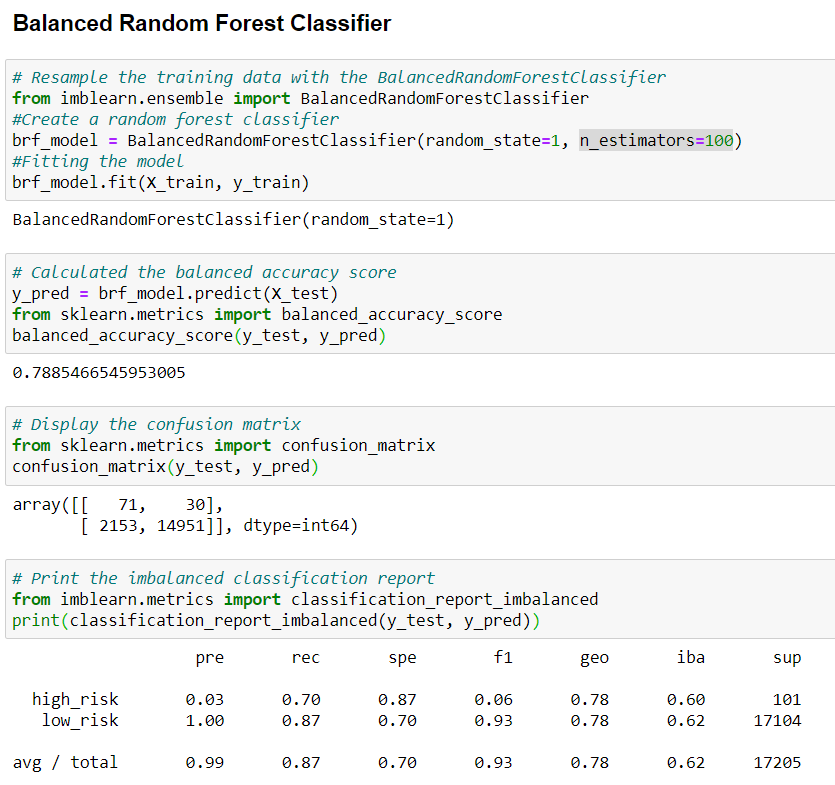
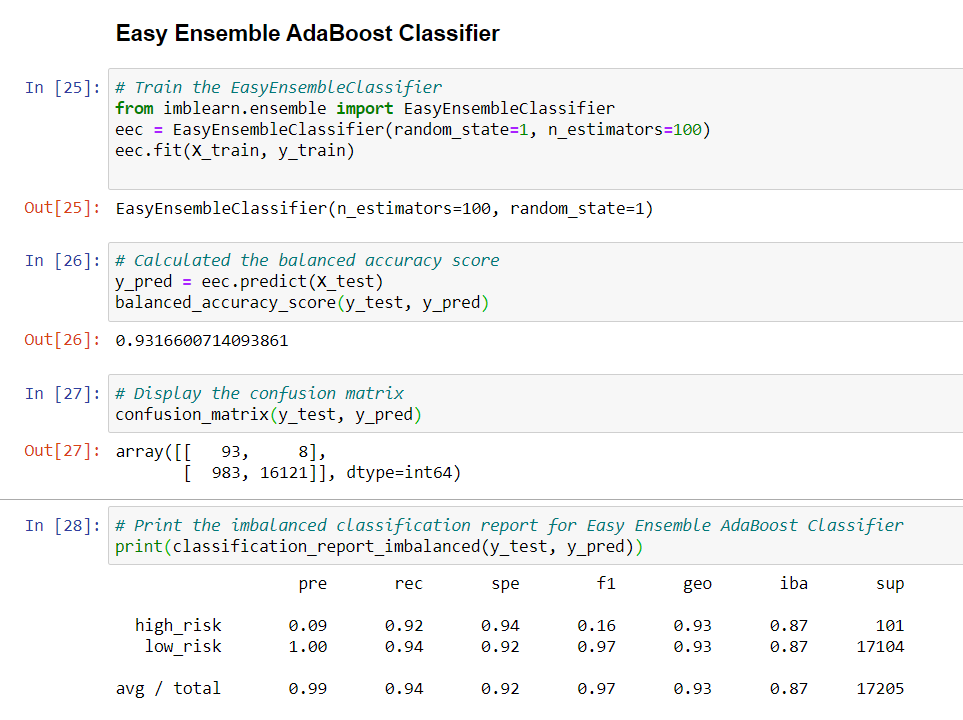

# Credit Risk Analysis

## Overview of the analysis
In this analysis, we used Scikit-learn and Imbalanced-learn libraries to build different machine learning models in order to predict credit risk for a lending institution. We also assessed how well each model works based on their accuracy scores, precision and recall scores.

## Tools used
Python 3.7

## Result
The balanced accuracy scores and the precision and recall scores for each model are as below:

*SMOTE Oversampling algorithm: the balanced accuracy score is 0.66, precision score is 0.01 for high risk loan and 1 for low risk loan. The recall score is 0.66 for high risk loan and 0.67 for low risk loan.

*Native Random Oversampling: the balanced accuracy score is 0.63, precision score is 0.01 for high risk loan and 1 for low risk loan. The recall score is 0.62 for high risk loan and 0.64 for low risk loan.

*ClusterCentroids Undersampling algorithm: the balanced accuracy score is 0.52, precision score is 0.01 for high risk loan and 1 for low risk loan. The recall score is 0.63 for high risk loan and 0.41 for low risk loan.

*SMOTEENN Sampling algorithm: the balanced accuracy score is 0.52, precision score is 0.01 for high risk loan and 1 for low risk loan. The recall score is 0.74 for high risk loan and 0.58 for low risk loan.

*Balanced Random Forest Classifier: the balanced accuracy score is 0.79, precision score is 0.03 for high risk loan and 1 for low risk loan. The recall score is 0.70 for high risk loan and 0.87 for low risk loan.

*Easy Ensemble AdaBoost Classifier: the balanced accuracy score is 0.93, precision score is 0.09 for high risk loan and 1 for low risk loan. The recall score is 0.92 for high risk loan and 0.94 for low risk loan.

## Summary
In general, oversampling gave us a better result in terms of higher balanced accuracy score which makes sense since undersampling would result in loss of data. In our case our dataset is not too huge so oversampling is better suited. The precision and recall score for both high risk and low risk loan are the same for both oversampling and undersampling; however, the recall score for high risk loan and low risk loan differ among oversampling, undersampling and combination of both. \n
Both Balanced Random Forest Classifier and Easy Ensemble AdaBoost Classifier algorithm have better balanced accuracy score, precision score and recall score than above mentioned 4 alorithms. Based on the result, I would receommend using the Easy Ensemble AdaBoost Classifier since it generated the best result not only on balanced accuracy score but also on precision and recall score for high risk loan. 
